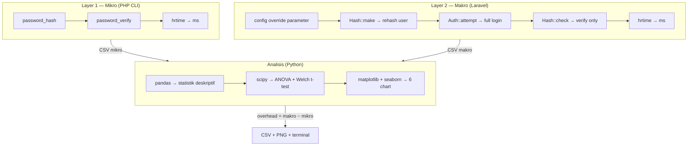
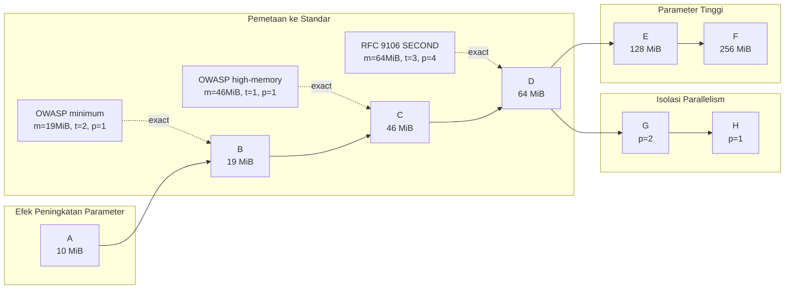

<div align="center">

# Argon2id Benchmark

**Benchmark dan analisis optimasi parameter Argon2id pada sistem autentikasi aplikasi web berbasis Laravel**


**Rio Mayesta** · [issecrux](https://github.com/issecrux)

</div>

---

## Daftar Isi

- [Gambaran Umum](#gambaran-umum)
- [Arsitektur Pengukuran](#arsitektur-pengukuran)
- [Skenario Parameter](#skenario-parameter)
- [Spesifikasi Pengujian](#spesifikasi-pengujian)
- [Struktur Project](#struktur-project)
- [Instalasi](#instalasi)
- [Menjalankan Benchmark](#menjalankan-benchmark)
- [Output dan Analisis](#output-dan-analisis)
- [Dependensi](#dependensi)
- [Referensi](#referensi)
- [License](#license)

---

## Gambaran Umum

Menguji pengaruh variasi parameter **Argon2id** — *memory cost*, *time cost*, dan *parallelism* — terhadap waktu *hashing* dan waktu verifikasi login pada sistem autentikasi aplikasi web berbasis Laravel.

Pendekatan yang digunakan adalah **pengukuran dua layer**:

| Layer | Metode | Yang Diukur |
|:---:|---|---|
| **Mikro** | PHP CLI murni (`password_hash()`) | Waktu komputasi Argon2id tanpa overhead framework |
| **Makro** | Laravel Artisan (`Auth::attempt()`) | Waktu verifikasi login dalam alur autentikasi penuh |
| **Overhead** | Makro − Mikro | Beban tambahan dari framework Laravel |

Pengukuran dilakukan sebanyak **50 iterasi + 10 warm-up** per skenario, menghasilkan **800 data point** (8 skenario × 50 × 2 layer).

---

## Arsitektur Pengukuran



---

## Skenario Parameter

8 skenario dirancang berdasarkan standar **RFC 9106** (IETF) dan **OWASP Password Storage Cheat Sheet** (2024):

| # | Label | memory (KiB) | memory (MiB) | time | p | Sumber Standar |
|:---:|---|---:|---:|:---:|:---:|---|
| **A** | Baseline | 10,240 | 10 | 2 | 1 | Laravel default |
| **B** | OWASP Min | 19,456 | 19 | 2 | 1 | OWASP 2024 minimum (exact) |
| **C** | OWASP High | 47,104 | 46 | 1 | 1 | OWASP 2024 high-memory (exact) |
| **D** | RFC SECOND | 65,536 | 64 | 3 | 4 | RFC 9106 SECOND RECOMMENDED (exact) |
| **E** | High Security | 131,072 | 128 | 4 | 1 | Custom — parameter tinggi |
| **F** | High Memory | 262,144 | 256 | 1 | 1 | Custom — batas RAM 4GB |
| **G** | Parallel 2 | 65,536 | 64 | 3 | 2 | Isolasi parallelism (2 lanes) |
| **H** | Parallel 1 | 65,536 | 64 | 3 | 1 | Isolasi parallelism (1 lane) |

### Desain Eksperimen



---

## Spesifikasi Pengujian

| Komponen | Detail |
|---|---|
| **Perangkat** | Laptop Lenovo 81WA |
| **CPU** | Intel Core i3-10110U @ 2.10 GHz (2C/4T) |
| **RAM** | 4 GB |
| **GPU** | Intel UHD Graphics + NVIDIA GeForce MX130 |
| **OS** | Windows 10 Home 64-bit |
| **PHP** | 8.3.31 (ZTS, sodium/Argon2id via libsodium 1.0.22) |
| **Laravel** | 13.11.2 |
| **Database** | SQLite 3.51.3 |
| **Python** | 3.11.9 |
| **Composer** | 2.9.8 |

---

## Struktur Project

```
argon2id-benchmark/
├── app/
│   ├── Console/Commands/
│   │   └── BenchmarkAuth.php          # Artisan command: makro benchmark
│   ├── Http/Controllers/
│   │   ├── AuthController.php          # Register, login, dashboard, logout
│   │   └── Controller.php
│   └── Models/
│       └── User.php
│
├── benchmark/
│   ├── micro_benchmark.php             # CLI script: mikro benchmark
│   ├── analyze_results.py              # Python: statistik + visualisasi
│   └── results/                        # Output CSV + charts (git-ignored)
│
├── config/
│   └── hashing.php                     # Argon2id driver configuration
│
├── database/
│   ├── database.sqlite                 # SQLite database (git-ignored)
│   ├── migrations/
│   └── seeders/
│       └── DatabaseSeeder.php          # Test user + benchmark user
│
├── resources/views/
│   ├── register.blade.php              # Form registrasi
│   ├── login.blade.php                 # Form login
│   └── dashboard.blade.php             # Halaman dashboard (protected)
│
├── routes/
│   └── web.php                         # 6 routes: register, login, dashboard, logout
│
└── storage/app/benchmark/              # Output CSV makro (git-ignored)
```

---

## Instalasi

### Prasyarat

- PHP >= 8.1 dengan ekstensi `sodium` (untuk Argon2id)
- Composer
- Python >= 3.9 (untuk analisis)

### Langkah

```bash
# 1. Clone repository
git clone https://github.com/Rimaestro/Argon2id-Benchmark.git
cd Argon2id-Benchmark

# 2. Install dependensi PHP
composer install

# 3. Setup environment
cp .env.example .env
php artisan key:generate

# 4. Setup database SQLite
touch database/database.sqlite
php artisan migrate --seed

# 5. Install dependensi Python (untuk analisis)
pip install pandas scipy matplotlib seaborn
```

### Verifikasi Argon2id

```bash
php artisan tinker
```

```php
>>> Hash::make('test')
// Output: $argon2id$v=19$m=10240,t=2,p=1$...
```

---

## Menjalankan Benchmark

### Layer 1: Mikro (PHP CLI Murni)

```bash
php benchmark/micro_benchmark.php
```

Mengukur waktu `password_hash()` dan `password_verify()` secara langsung tanpa Laravel. Output disimpan ke `benchmark/results/results_micro_*.csv`.

Estimasi waktu: **30-60 menit** (tergantung skenario high memory).

### Layer 2: Makro (Laravel Artisan)

```bash
php artisan benchmark:auth
```

Mengukur waktu `Auth::attempt()` dalam alur autentikasi Laravel penuh (DB lookup + hash verify + session). Output disimpan ke `storage/app/benchmark/results_macro_*.csv`.

Opsi CLI:

```bash
php artisan benchmark:auth --iterations=100 --warmup=20
```

### Analisis (Python)

```bash
python benchmark/analyze_results.py \
  --micro benchmark/results/results_micro_*.csv \
  --macro storage/app/benchmark/results_macro_*.csv
```

---

## Output dan Analisis

Script Python menghasilkan:

### Terminal

- Tabel statistik deskriptif per skenario (mean, median, SD, min, max, CV%)
- Hasil one-way ANOVA (F-statistic, p-value)
- Pairwise comparison (Welch t-test) dengan signifikansi

### File CSV

| File | Isi |
|---|---|
| `analysis_combined.csv` | Rekapitulasi statistik mikro + makro + overhead |
| `anova_results.csv` | Hasil ANOVA per layer |
| `tukey_micro.csv` | Pairwise comparison mikro (28 pasangan) |
| `tukey_macro.csv` | Pairwise comparison makro (28 pasangan) |

### Chart PNG (6 file)

| # | File | Jenis |
|---|---|---|
| 1 | `01_bar_mikro_mean.png` | Bar chart — rata-rata waktu hashing per skenario |
| 2 | `02_bar_makro_mean.png` | Bar chart — rata-rata waktu login per skenario |
| 3 | `03_grouped_mikro_vs_makro.png` | Grouped bar — mikro vs makro |
| 4 | `04_overhead_framework.png` | Bar chart — overhead framework per skenario |
| 5 | `05_boxplot_mikro.png` | Box plot — distribusi waktu hashing |
| 6 | `06_boxplot_makro.png` | Box plot — distribusi waktu login |

---

## Dependensi

### PHP (via Composer)

| Package | Fungsi |
|---|---|
| `laravel/framework` ^13.0 | Web framework |
| `laravel/tinker` | REPL untuk testing |

### Python (via pip)

| Package | Fungsi |
|---|---|
| `pandas` | Pembacaan CSV, manipulasi data |
| `scipy` | ANOVA, t-test |
| `matplotlib` | Visualisasi (bar chart, box plot) |
| `seaborn` | Visualisasi statistik lanjutan |

---

## Referensi

| # | Sumber | Tahun | Relevansi |
|---|---|---|---|
| 1 | [RFC 9106 — Argon2 Memory-Hard Function](https://datatracker.ietf.org/doc/html/rfc9106) | 2021 | Standar parameter Argon2id |
| 2 | [OWASP Password Storage Cheat Sheet](https://cheatsheetseries.owasp.org/cheatsheets/Password_Storage_Cheat_Sheet.html) | 2024 | Rekomendasi minimum parameter |
| 3 | Eum et al. — Optimized Implementation of Argon2 Utilizing GPU | 2023 | Performa Argon2 pada hardware |
| 4 | Listiawan et al. — Optimising Bcrypt Parameters | 2024 | Metodologi optimasi parameter |
| 5 | Fedorchenko et al. — Password Hashing Methods on .NET | 2024 | Perbandingan algoritma hashing |
| 6 | Saran — Time-Memory Trade-Offs in PHS | 2024 | Analisis trade-off Argon2id |

---

## License

MIT
